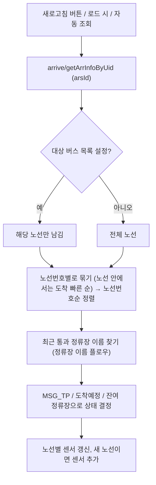
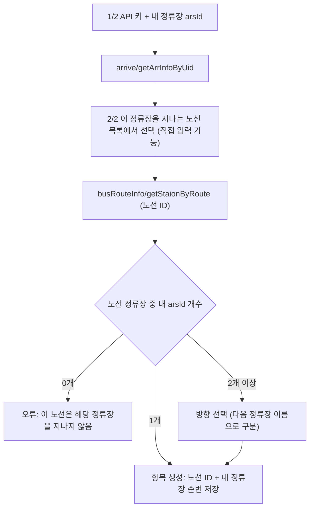
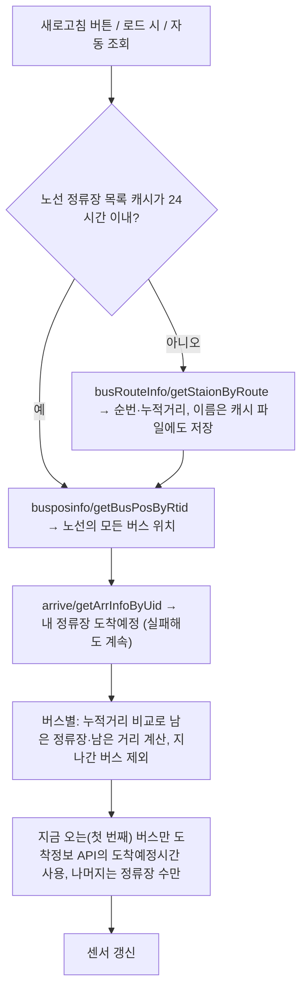
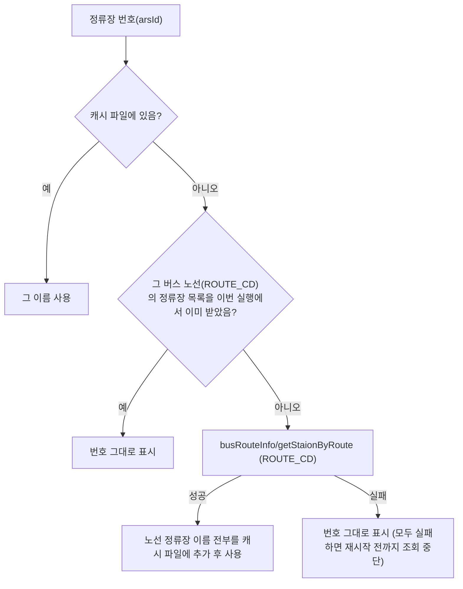
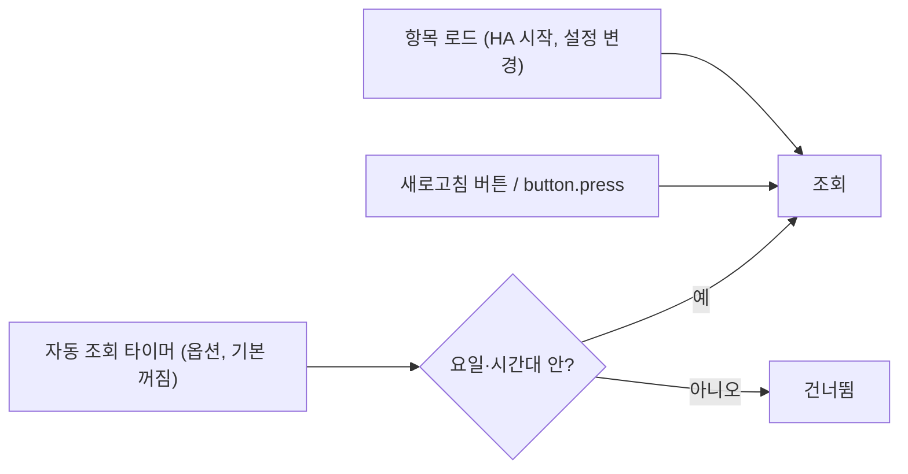
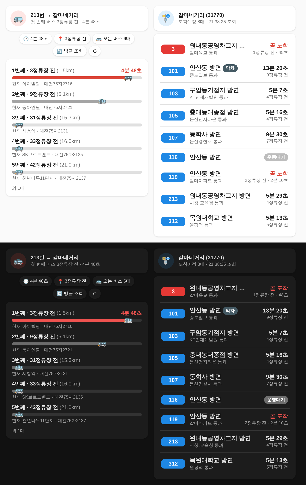

# 대전 버스 (Daejeon Bus) for Home Assistant

대전광역시 버스정보(BIS) 공공데이터 API를 쓰는 Home Assistant 커스텀 통합구성요소입니다.
[miumida/seoul_bus](https://github.com/miumida/seoul_bus)를 참고해 만들었습니다.

조회 방식은 두 가지이고, 항목을 추가할 때 고릅니다.

| 조회 방식 | 용도 | 입력 | 보여주는 것 |
| --- | --- | --- | --- |
| **정류장 도착정보** | 정류장에 오는 모든 버스 보기 | 정류장 번호 `arsId` | 노선별 도착예정시간, 잔여 정류장 수, 최근 통과 정류장 |
| **노선으로 조회** | 내가 탈 노선이 어디쯤 오는지 보기 | 내 정류장 `arsId` + 노선 | 지금 오는 버스의 **도착예정시간**, 그 노선 버스마다 내 정류장까지 **몇 정류장 전 / 몇 m** |

- **조회 시점:** 기본은 자동 갱신이 없습니다. 항목을 로드할 때 1회 조회하고, 이후에는 `새로고침` 버튼을 누를 때만 조회합니다.
- **자동 조회:** [옵션](#자동-조회-옵션-기본-꺼짐)에서 요일과 시간대를 정해 켤 수 있습니다.

## 목차
- [설치](#설치)
- [사용하는 API](#사용하는-api)
- [기능 플로우](#기능-플로우)
- [정류장 도착정보](#정류장-도착정보)
- [노선으로 조회](#노선으로-조회)
- [정류장 이름](#정류장-이름)
- [자동 조회 옵션 (기본 꺼짐)](#자동-조회-옵션-기본-꺼짐)
- [삭제·초기화](#삭제초기화)
- [도착정보 응답 항목](#도착정보-응답-항목-getarrinfobyuid)
- [대시보드 예시](#대시보드-예시)

## 설치

### HACS
1. HACS → 사용자 지정 저장소 → `https://github.com/phoenix9469/DaejeonBus_HA` (유형: Integration)
2. `대전 버스` 설치 후 Home Assistant 재시작

### 수동
`custom_components/daejeon_bus` 폴더를 Home Assistant 설정 폴더의 `custom_components/` 아래에 복사한 뒤 재시작합니다.

### 항목 추가
설정 → 기기 및 서비스 → 통합구성요소 추가 → **대전 버스** → **정류장 도착정보** 또는 **노선으로 조회**

API 키는 [공공데이터포털](https://www.data.go.kr)에서 발급받은 대전광역시 버스정보 서비스키입니다. 인코딩·디코딩 키 모두 됩니다.

## 사용하는 API

모두 `https://apis.data.go.kr/6300000/` 아래에 있고, XML로 응답합니다. 항목 뜻은 대전 BIS「OpenAPI 활용가이드 v1.3」 기준입니다.

| API | 경로 | 요청 | 쓰는 응답 항목 | 쓰는 곳 |
| --- | --- | --- | --- | --- |
| 정류장 버스도착정보 | `arrive/getArrInfoByUid` | `arsId` | `ROUTE_CD`, `ROUTE_NO`, `DESTINATION`, `CAR_REG_NO`, `EXTIME_SEC`, `EXTIME_MIN`, `STATUS_POS`, `LAST_STOP_ID`, `MSG_TP`, `LAST_CAT`, `ROUTE_TP`, `STOP_NAME` | 정류장 도착정보 (조회할 때마다), 노선으로 조회 (도착시간 보정, 설정할 때 노선 목록) |
| 노선 버스 위치 | `busposinfo/getBusPosByRtid` | `busRouteId` | `PLATE_NO`, `TOTAL_DIST`, `BUS_STOP_ID` | 노선으로 조회 (조회할 때마다) |
| 노선 경유 정류장 | `busRouteInfo/getStaionByRoute` | `busRouteId` (노선 ID 8자리) | `BUSSTOP_SEQ`, `BUS_STOP_ID`, `BUSSTOP_NM`, `TOTAL_DIST` | 노선으로 조회 (설정할 때 + 하루 1번), 정류장 이름 (캐시 파일에 없을 때 노선마다 1번) |

- **오퍼레이션 이름 표기:** `getStaionByRoute`는 원래 API 이름의 철자 그대로입니다(Station 아님).
- **정류장 정보 API(`stationinfo`)는 쓰지 않습니다:** 개발 키로는 `SERVICE ACCESS DENIED`가 나와서, 정류장 이름은 노선 경유 정류장 API로 받습니다.
- **호출 수 제한:** 공공데이터포털 개발 키는 하루 호출 수 제한(보통 1,000회)이 있습니다.

| 동작 | API 호출 수 |
| --- | --- |
| 정류장 도착정보 1회 조회 | 1회 (+ 이름을 모르는 정류장이 있으면 그 버스 노선의 정류장 목록, 노선마다 처음 1번) |
| 노선으로 조회 1회 조회 | 2회 (버스 위치 + 도착정보), 정류장 목록은 하루 1번 |

## 기능 플로우

### 1. 정류장 도착정보



설정 플로우: `API 키 + 정류장 번호` → 도착정보 API 1회 호출로 키와 정류장 확인 → 항목 생성 (제목 = `STOP_NAME`)

### 2. 노선으로 조회

**설정 플로우**



**조회 플로우**



**남은 정류장 · 남은 거리 계산** (213번, 내 정류장 갈마네거리 31770 예시)

```
노선 정류장 목록 (getStaionByRoute)          버스 위치 (getBusPosByRtid)
 순번  정류장        누적거리(m)               차량          누적거리(m)
 ...
 55   동아연필       26201   ◀──────────────  대전75자2721  26201
 ...
 61   아이빌딩       29819   ◀──────────────  대전75자2716  29819
 62   은하수네거리   30166
 63   갈마육교       30885
 64   갈마네거리     31283   ★ 내 정류장
 ...
 77   도안아이파크   38747   ◀──────────────  대전75자2704  38747  (이미 지나감 → 제외)
```

- **남은 정류장** = 내 정류장 순번 − 버스가 지난 정류장 순번. 예: 아이빌딩 버스는 64 − 61 = **3정류장 전**
- **남은 거리** = 내 정류장 누적거리 − 버스 누적거리. 예: 31283 − 29819 = **1,464m**
- **지나간 버스:** 버스 누적거리가 내 정류장보다 크면 이미 지나간 버스라서 제외합니다.
- **상행·하행 구분:** 누적거리가 왕복 전체 기준이라 방향이 따로 구분됩니다.
- **도착예정시간:** **지금 오는(첫 번째) 버스만** 보여줍니다.
  - 도착정보 API에서 같은 차량번호의 `EXTIME_SEC`를 씁니다(예: 300초 = 5분).
  - 차량번호가 맞지 않으면(두 API의 갱신 시점 차이) 이 노선의 가장 빠른 도착정보를 씁니다.
  - 두 번째 이후 버스는 추정하지 않고 **몇 정류장 전 / 몇 m**만 보여줍니다.

### 3. 정류장 이름



### 4. 조회 시점



## 정류장 도착정보

### 설정

| 항목 | 설명 |
| --- | --- |
| API 키 | 공공데이터포털 서비스키 |
| 정류장 번호 (arsId) | 정류장 표지판의 5자리 번호, 예: `31770` |
| 정류장 이름 (선택) | 비워두면 API의 정류장 이름(`STOP_NAME`) 사용 |
| 대상 버스 목록 (선택) | 쉼표로 구분한 노선번호, 예: `3,103,119`. 비워두면 전체 노선 |

나중에 `구성`에서 바꿀 수 있는 것: API 키, 이름, 대상 버스, `'곧 도착' 기준 (분)`, 자동 조회

### 엔티티 (arsId `31770` 예시)

| 엔티티 | 상태 | 주요 속성 |
| --- | --- | --- |
| `sensor.daejeon_bus_31770_3` (노선별) | `5분 7초 (4정류장 전)` / `곧 도착 (1정류장 전)` / `도착` / `진입중` / `운행대기` | `운행 상태`, `메시지 유형`, `첫/막차`, `노선유형`, `잔여 정류장 수`, `최근 통과 정류소`, `최근 통과 정류소 ID`, `도착예정시간`, `도착예정(분)`, `도착예정(초)`, `행선지`, `차량번호`, `정보 제공 시각`, `다음 버스` |
| `sensor.daejeon_bus_31770` | 도착예정 버스 수 (운행대기 제외) | `버스 목록` (노선별 첫 차 요약) |
| `sensor.daejeon_bus_31770_last_update` | 마지막 조회 시각 | |
| `sensor.daejeon_bus_31770_api_usage` | 자동 조회 예상 API 호출 (회/일) | [예상 API 호출 수](#예상-api-호출-수) |
| `button.daejeon_bus_31770_refresh` | 새로고침 | |
| `button.daejeon_bus_31770_reset_routes` | 노선 센서 초기화 | [삭제·초기화](#삭제초기화) |
| `button.daejeon_bus_31770_clear_cache` | 정류장 이름 캐시 삭제 | [삭제·초기화](#삭제초기화) |

- **노선 센서 생성:** 노선 센서는 도착정보에 나온 노선마다 생깁니다. 새로고침 후 새 노선이 보이면 자동으로 추가됩니다.
- **대상 버스 목록:** 지정하면 그 노선 센서만 남고 나머지는 지워집니다. `구성`에서 칸을 비우면 다시 전체 노선으로 돌아갑니다.
- **도착정보가 없을 때:** 그 노선의 도착정보가 없으면 상태는 `도착정보 없음`입니다.
- **상태 결정 순서:** 노선 센서 상태는 아래 순서로 정해집니다.
  1. `MSG_TP` `01` → **도착**
  2. `MSG_TP` `06` → **진입중**
  3. `MSG_TP` `07` → **운행대기** (차고지 대기, 도착시간·위치 값 없음)
  4. 도착예정시간이 기준 이하 → **곧 도착 (N정류장 전)** (기본 3분, 0이면 끔)
  5. 그 외 → **도착예정시간 (N정류장 전)**
- **실제 남은 시간:** 상태가 `곧 도착`이어도 실제 남은 시간은 `도착예정시간` 속성에 있습니다.
- **정렬:** `버스 목록`과 노선 센서는 **노선번호순**입니다. 숫자 노선은 숫자 크기순(3 → 101 → 103 → 119)이고, `급행`·`마을` 같은 문자 노선은 그 뒤에 옵니다. 같은 노선에 버스가 여러 대면 도착이 빠른 버스가 첫 차이고, 나머지는 `다음 버스` 속성에 있습니다.

## 노선으로 조회

특정 노선의 버스가 **내 정류장까지 몇 정류장 전인지, 몇 m 남았는지** 보여줍니다. 계산 방법은 [기능 플로우](#2-노선으로-조회)를 보세요.

### 설정
1. **내 정류장**: API 키, 정류장 번호(arsId)
2. **노선**: 그 정류장 도착정보에 나오는 노선 중 선택
   - 목록에 없으면(심야 등) 노선번호나 노선 ID(8자리, 예: `30300146`)를 직접 입력합니다.
3. **방향**: 노선이 그 정류장을 두 번 지날 때만 고릅니다.

나중에 `구성`에서 바꿀 수 있는 것: API 키, 자동 조회

### 엔티티 (213번, 갈마네거리 31770 예시)

| 엔티티 | 상태 예시 | 내용 |
| --- | --- | --- |
| `sensor.daejeon_bus_commute_213_31770_first_stops` | `3` (정류장) | 첫 번째 버스 **몇 정류장 전** |
| `sensor.daejeon_bus_commute_213_31770_first_minutes` | `4분 48초` | 첫 번째 버스 도착예정 (분·초). 자동화용 숫자는 속성 `도착예정(초)`, `도착예정(분)` |
| `sensor.daejeon_bus_commute_213_31770_second_stops` | `9` (정류장) | 두 번째 버스 **몇 정류장 전** (도착예정시간 없음) |
| `sensor.daejeon_bus_commute_213_31770` (오는 버스) | `6` (대) | 속성 `버스 목록`: 오고 있는 버스 전체 |
| `sensor.daejeon_bus_commute_213_31770_last_update` | 시각 | 마지막 조회 |
| `sensor.daejeon_bus_commute_213_31770_api_usage` | `243` (회/일) | [자동 조회 예상 API 호출](#예상-api-호출-수) |
| `button.daejeon_bus_commute_213_31770_refresh` | | 새로고침 |
| `button.daejeon_bus_commute_213_31770_clear_cache` | | [정류장 이름 캐시 삭제](#삭제초기화) |

버스별 속성:

| 속성 | 뜻 |
| --- | --- |
| `남은 정류장` | 몇 정류장 전 |
| `남은 거리(m)` | 내 정류장까지 거리 |
| `도착예정시간`, `도착예정(초)`, `도착예정(분)` | 예: `4분 48초`, `288`, `4.8`. **지금 오는 버스에만** 있음 |
| `현재 정류장`, `현재 정류장 ID` | 버스가 지금 있는(지난) 정류장 |
| `차량번호` | |

### 자동화 예시: 3정류장 이내로 오면 알림
```yaml
triggers:
  - trigger: numeric_state
    entity_id: sensor.daejeon_bus_commute_213_31770_first_stops
    below: 4
actions:
  - action: notify.mobile_app_내폰
    data:
      message: >
        213번 {{ states('sensor.daejeon_bus_commute_213_31770_first_stops') }}정류장 전
        ({{ state_attr('sensor.daejeon_bus_commute_213_31770_first_stops', '남은 거리(m)') }}m),
        {{ states('sensor.daejeon_bus_commute_213_31770_first_minutes') }} 후 도착
```

## 정류장 이름

도착정보 API는 최근 통과 정류장을 번호(`LAST_STOP_ID`)로만 줍니다. 그 정류장은 그 버스 노선 위에 있으므로, 같은 응답에 있는 노선 ID(`ROUTE_CD`)로 **노선 경유 정류장 목록**을 받아 이름을 찾습니다([정류장 이름 플로우](#3-정류장-이름)). 노선 하나를 받으면 그 노선의 정류장 이름이 모두 저장되므로, 같은 노선은 다시 조회하지 않습니다.

- **캐시 파일:** `/config/daejeon_bus_stop_names.json` (HA 설정 폴더 바로 아래, `configuration.yaml`과 같은 위치)
  - 모든 항목이 같이 씁니다. 형식은 정류장 번호와 이름뿐입니다.
    ```json
    {
     "31770": "갈마네거리",
     "31910": "갈마육교"
    }
    ```
  - 새 이름이 생기면 약 10초 뒤(그리고 HA 종료 때) 저장됩니다.
  - 이전 버전의 `/config/.storage/daejeon_bus_stop_names`가 있으면 처음 읽을 때 이 파일로 옮기고 지웁니다.
  - 노선으로 조회는 노선 정류장 목록을 받을 때 그 이름들도 이 파일에 넣습니다.
- **API 조회 실패 시:** 로그에 경고가 남고 번호로 표시합니다. 서비스키 권한 문제일 수 있으니 공공데이터포털에서 대전광역시 버스노선정보 조회 서비스 활용신청 여부를 확인하세요.
- **이름 고치기·새로 받기:** `정류장 이름 캐시 삭제` 버튼(또는 서비스)으로 파일을 지우면 다음 조회 때 다시 받습니다. 파일을 직접 고칠 때는 HA를 중지하고 수정하세요. 실행 중에 고치면 덮어써질 수 있습니다.

## 자동 조회 옵션 (기본 꺼짐)

두 조회 방식 모두 `구성`에서 켤 수 있습니다.

| 옵션 | 기본값 | 설명 |
| --- | --- | --- |
| 자동 조회 사용 | 꺼짐 | 끄면 새로고침 버튼으로만 조회 |
| 시작 / 종료 시각 | 07:00 / 09:00 | 같으면 하루 종일, 자정을 넘는 구간 가능 |
| 요일 | 월~금 | 하나도 고르지 않으면 조회 안 함 |
| 간격 | 60초 | 최소 30초 |

### 예상 API 호출 수

공공데이터포털 트래픽 한도는 **활용신청한 API마다 따로** 매겨집니다(개발계정 보통 1,000회/일). 같은 서비스키를 쓰는 항목들의 호출은 합쳐집니다.

- **설정 화면:** `구성` 화면 위쪽에 현재 설정 기준 예상 호출 수가 나옵니다. 자동 조회를 켜고 제출하면, **저장 전에 확인 화면**에서 바꾼 설정 기준 예상치를 한 번 더 보여줍니다. API별 하루 예상, 한도 대비 %, 주간 합계가 나오고, 한도를 넘으면 ⚠️로 경고합니다.
- **센서:** `sensor.…_api_usage` 상태는 하루 예상 호출 수(회/일)입니다. 속성은 아래와 같습니다.

| 속성 | 내용 |
| --- | --- |
| `API별 하루 예상` | 예: 버스위치 121, 도착정보 121, 노선정류장 1 |
| `같은 키 전체 하루 예상` | 같은 서비스키를 쓰는 모든 항목 합계 |
| `오늘 실제 호출` | 오늘(0시부터) 이 항목이 실제로 부른 API 수 |
| `하루 자동 조회 횟수`, `주간 예상 합계`, `개발계정 한도 대비(%)` | |

| 예시 | 하루 예상 |
| --- | --- |
| 정류장 도착정보, 07:00~09:00, 60초 | 도착정보 121회 |
| 노선으로 조회, 07:00~09:00, 60초 | 버스위치 121회 + 도착정보 121회 + 노선정류장 1회 = 243회 |
| 정류장 도착정보, 하루 종일, 30초 | 도착정보 2,880회 ⚠️ 한도 초과 |

- **계산에서 빠지는 것:** 새로고침 버튼으로 직접 조회한 횟수와, 정류장 도착정보의 이름 조회(노선마다 처음 1번)는 예상치에 포함하지 않습니다(`오늘 실제 호출`에는 포함).

## 삭제·초기화

| 동작 | 버튼 | 서비스 | 내용 |
| --- | --- | --- | --- |
| 정류장 이름 캐시 삭제 | `button.…_clear_cache` (모든 항목) | `daejeon_bus.clear_stop_name_cache` | `/config/daejeon_bus_stop_names.json` 파일을 지웁니다. 이름은 다음 조회 때 API(노선으로 조회는 노선 정류장 목록)로 다시 채워집니다. 모든 항목이 같은 파일을 쓰므로 어느 버튼을 눌러도 같습니다 |
| 노선 센서 초기화 | `button.…_reset_routes` (정류장 도착정보) | `daejeon_bus.reset_route_entities` | 정류장 도착정보가 만든 노선별 센서를 모두 지우고 항목을 다시 불러옵니다. 지금 도착정보에 있는 노선(또는 대상 버스 목록)만 다시 만들어집니다. 더 이상 오지 않는 노선 센서를 정리할 때 씁니다 |

- **서비스 응답:** 두 서비스 모두 삭제한 개수를 응답으로 돌려줍니다.
- **대상 지정:** `reset_route_entities`는 `config_entry_id`를 비우면 모든 정류장 도착정보 항목에 적용됩니다.
- **버튼 위치:** 삭제 버튼은 기기 페이지의 **설정** 영역에 있습니다.

## 도착정보 응답 항목 (getArrInfoByUid)

| 항목 | 뜻 | 값 / 비고 | 센서 속성 |
| --- | --- | --- | --- |
| `BUS_NODE_ID` | 요청 정류장 ID (7자리) | 예: `8001056` | |
| `BUS_STOP_ID` | 요청 정류장 ARS-ID | 대전 5자리, 광역 6자리 | `정류소 ID(arsId)` |
| `STOP_NAME` | 요청 정류장 명칭 | | `정류소 이름` |
| `ROUTE_CD` | 노선 ID (8자리) | | `노선 ID` |
| `ROUTE_NO` | 노선번호 | | `노선번호` |
| `ROUTE_TP` | 노선유형 | 1 급행 · 2 간선 · 3 지선 · 4 외곽 · 5 마을 · 6 첨단 | `노선유형` |
| `DESTINATION` | 종점 | | `행선지` |
| `CAR_REG_NO` | 차량번호 | | `차량번호` |
| `EXTIME_MIN` | 도착예정시간(분) | 올림한 분 | `도착예정(분)` |
| `EXTIME_SEC` | 도착예정시간(초) | 남은 전체 초 (예: 317초 = 5분 17초, MIN=6) | `도착예정(초)`, `도착예정시간`, 상태값 |
| `STATUS_POS` | 잔여 정류장 수 | | `잔여 정류장 수` |
| `LAST_STOP_ID` | 최근 통과 정류장 ID (arsId) | 이름으로 변환 | `최근 통과 정류소`, `최근 통과 정류소 ID` |
| `MSG_TP` | 메시지유형 | 01 도착 · 02 출발 · 03 몇분후 도착 · 04 교차로 통과 · 06 진입중 · 07 차고지 운행대기중 | `메시지 유형`, `운행 상태` |
| `LAST_CAT` | 첫/막차 구분 | 1 첫차 · 2 막차 · 3 일반 (운행대기 차량은 0으로 오기도 함) | `첫/막차` |
| `INFO_OFFER_TM` | 정보 생성 시간 | | `정보 제공 시각` |

## 대시보드



*위 이미지는 실제 응답 샘플(213번 노선, 갈마네거리 31770)로 만든 미리보기입니다. 실제 화면에서는 아이콘이 MDI 아이콘으로 나옵니다.*

### HACS 카드로 꾸미기 (권장)
HACS → 프런트엔드에서 아래 두 카드를 설치합니다.

| 카드 | 저장소 | 쓰는 곳 |
| --- | --- | --- |
| Mushroom | [piitaya/lovelace-mushroom](https://github.com/piitaya/lovelace-mushroom) | 머리글, 요약 칩 |
| button-card | [custom-cards/button-card](https://github.com/custom-cards/button-card) | 버스 목록, 진행 막대 |

설치 후 대시보드 편집 → 카드 추가 → **수동**에 아래 파일 내용을 붙여넣습니다. 엔티티 이름(`daejeon_bus_commute_213_31770`, `daejeon_bus_31770`)은 내 항목에 맞게 바꾸세요.

| 파일 | 카드 구성 |
| --- | --- |
| [`dashboards/route_lookup.yaml`](dashboards/route_lookup.yaml) | **노선으로 조회** (아래 표) |
| [`dashboards/station_arrivals.yaml`](dashboards/station_arrivals.yaml) | **정류장 도착정보** (아래 표) |

**노선으로 조회 카드**

| 구성 | 내용 |
| --- | --- |
| 머리글 | 첫 번째 버스 몇 정류장 전·도착예정. 아이콘 색: 3정류장 이내 빨강, 7정류장 이내 주황. 누르면 새로고침 |
| 요약 칩 | 첫 버스 도착예정(분·초), 몇 정류장 전, 오는 버스 수, 조회 시각, 새로고침 |
| 오고 있는 버스 | 최대 5대. 내 정류장에 가까울수록 막대가 깁니다. 첫 버스만 도착예정시간을 표시하고, 3정류장 이내면 빨간색입니다 |

`variables`의 `max_rows`(보여줄 버스 수)와 `scale_stops`(막대 기준 정류장 수)로 조절할 수 있습니다.

**정류장 도착정보 카드**

| 구성 | 내용 |
| --- | --- |
| 머리글 | 정류장 이름, 도착예정 버스 수, 조회 시각. 누르면 새로고침, 길게 누르면 상세 |
| 노선 목록 | 노선번호 배지(노선유형별 색: 급행 빨강 · 간선 파랑 · 지선 초록 · 외곽 갈색 · 마을 주황 · 첨단 보라), 행선지, 최근 통과 정류장, 도착예정 |
| 상태 강조 | `곧 도착`·`진입중`은 빨간색, `운행대기`는 회색, `첫차`·`막차`는 태그로 표시 |

### HACS 없이 (기본 카드)

#### 정류장 도착정보
```yaml
type: vertical-stack
cards:
  - type: button
    entity: button.daejeon_bus_31770_refresh
    name: 새로고침
    tap_action:
      action: perform-action
      perform_action: button.press
      target:
        entity_id: button.daejeon_bus_31770_refresh
  - type: markdown
    content: >
      
      **{{ state_attr(s, '정류소 이름') }}** ({{ state_attr(s, '정류소 ID(arsId)') }})
      · 조회 {{ as_timestamp(states('sensor.daejeon_bus_31770_last_update')) | timestamp_custom('%H:%M:%S') }}

      | 노선 | 도착예정 | 최근 통과 | 행선지 |
      |---|---|---|---|
      
      | {{ b['노선'] }} | {{ b['도착예정'] }} | {{ b['최근 통과 정류소'] }} | {{ b['행선지'] }} |
      
```

#### 노선으로 조회
```yaml
type: vertical-stack
cards:
  - type: button
    entity: button.daejeon_bus_commute_213_31770_refresh
    name: 새로고침
    tap_action:
      action: perform-action
      perform_action: button.press
      target:
        entity_id: button.daejeon_bus_commute_213_31770_refresh
  - type: markdown
    content: >
      
      **{{ state_attr(s, '노선번호') }}번 → {{ state_attr(s, '내 정류장') }}** · {{ states(s) }}

      | 순번 | 몇 정류장 전 | 남은 거리 | 도착예정 | 현재 위치 |
      |---|---|---|---|---|
      
      | {{ b['순번'] }} | {{ b['남은 정류장'] }} | {{ b['남은 거리(m)'] }}m | {{ b['도착예정시간'] or '-' }} | {{ b['현재 정류장'] }} |
      
```
